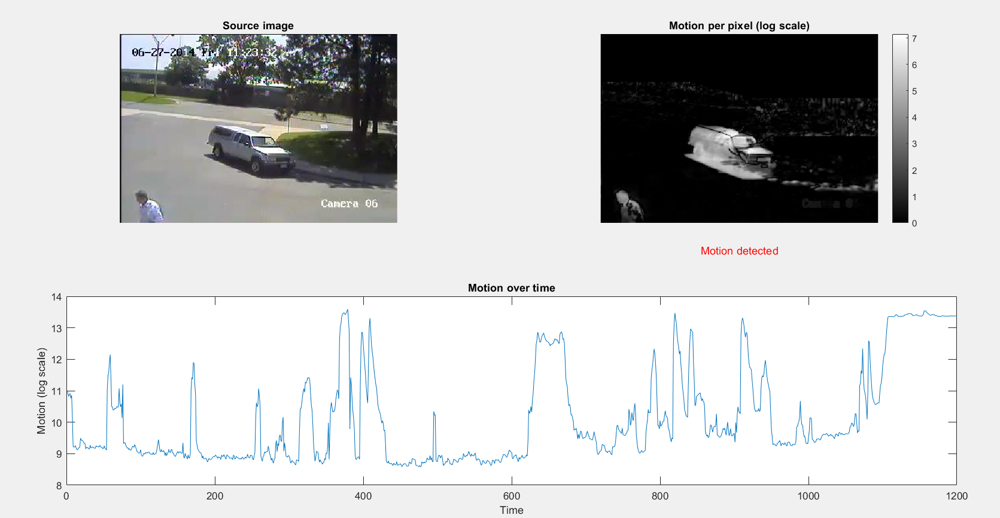

# Motion Detection (MATLAB, Gaussian background model)

## Description
This repository extends a lab from the GPA659 course at ÉTS Montréal. It implements motion detection using a Gaussian background model (per-pixel mean and standard deviation). After preprocessing (masking noisy regions and applying an averaging filter), the method computes the normalized squared deviation pixel per pixel, aggregates it into a global motion metric, and compares it to a threshold. The background model is trained on 80% of the dataset (first 960 frames) and then evaluated on the full sequence.

## Quick Start
Clone the repository:
```bash
git clone https://github.com/nellbru/motion-detection-matlab.git
cd motion-detection-matlab
```

Open MATLAB and run `model_parameters.m` to build the background model (trained on frames 1–960).

Then run `test_motion_detection.m` to evaluate the model on the whole dataset and display the motion detection.

## Results
The visualization shows:
- source image
- motion per pixel (log scale) with a colorbar
- motion (log scale) within the whole image over time

<p align="center">
  
</p>

The script also reports summary counts (`realMotionCount`, `modelMotionCount`, `diff`) and overall `accuracy`, which is 95.5%. The remaining 4.5% error is inherent to the background modeling method used, new but stationary objects in the scene (for example a car that stops) are treated as motion because they differ from the learned background.

## Project Structure
    motion-detection-matlab/
    ├─ data/                    # Input frames
    ├─ docs/                    # Documentation assets
    ├─ labels.mat               # Ground truth labels
    ├─ model.mat                # Saved background model (generated)
    ├─ model_parameters.m       # Script to generate the model
    ├─ motion_detection.m       # Detection function
    ├─ test_motion_detection.m  # Script to run the full pipeline
    ├─ .gitignore               # Ignore rules for Git
    ├─ LICENSE                  # Project license
    └─ README.md                # Project documentation

## Requirements
- MATLAB (R2018b or newer)

## License
This project is licensed under the terms of the [LICENSE](LICENSE) file.
